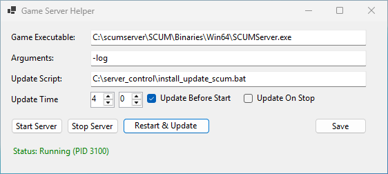

# GameServerHelper

Simple helper tool for running game servers with graceful restart and daily updating.  



## Running

Copy the exe to a directory on your games server and run the executable. Input the respective options you require:
- Game Executable: Path to the server .exe
- Arguments: Any arguments that need to be appended to the game server executable
- Update Script: Path to a script which will run on schedule and on start/stop if selected
- Update Time: Server hours to gracefully stop the server and run the update script

The server PID will be detected upon start and restart, so the Game Server Helper can be stopped and started at will.  

Clicking the Save button will persist the settings to a local JSON file in the same directory.

## Building

Requires building on Windows in a .NET environment

```
dotnet restore
dotnet build --configuration Release --no-restore
```
